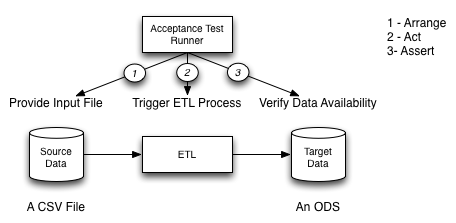

WIP

>
> Please Note: No attempt at TDD was made here.
>

Why?
====
Our current project issue is that we do not have any automated testing mechanisms for ETL activities.
All ETL testing would otherwise be done manually.
Additionally we do not have any unit testing tools for our ETL technology. 
The question arises, how do we verify that our ETL process is doing the right thing.
The proposed solution is to use an Acceptance Test Driven Development (ATDD) approach. 
>
> INSERT: What is ATDD, How it is not TDD
>
The end result will be an automated test suite that shows the ETL correctly executes and satisfies the business objectives.  			
			
By involving the Product Owner in the testing process we have a higher expectation of correctness in our result. 
We will use the Three Amigos approach to developing our acceptance tests.
The Three Amigos are the Product Owner, Tester, and Developer.
In our case, the Tester is also a Developer.
The Three Amigos meet to discuss a story and determine what tests would satisfy that story. 
In the simple case, a happy path story might be;

```
	As the Share ODS
	I want nightly orders transfered from the legacy system into my data structure
	So that I can serve operational systems with yesterdays data.\*
```

<em>\* This story is completely fictitious, any resemblance to a real user story is purely coincidental</em>
 
And the first test for that story would likely be;

```gherkin
  	Given a nightly orders load file
 	When the file arrives on the landing area
  	Then Nightly Orders are loaded into the ODS
```

Each participant would then add additional scenarios that flesh out the work related to the original story.

Some example tests might be;

```gherkin
	Scenario: Empty Orders File
	Given an empty nightly orders load file
	When the file arrives on the landing area
	Then no changes occur in the ODS
	And an empty file notification is logged
```

```gherkin  
  	Scenario: Corrupt Orders File
	Given a corrupt nightly orders load file
	When the file arrives on the landing area
	Then no changes occur in the ODS
	And a corrupt file notification is logged
```

```gherkin  
	Scenario: Partially Corrupt Orders File
	Given a partially corrupt nightly orders load file
	When the file arrives on the landing area
	Then no changes occur in the ODS
	And a corrupt file notification is logged
```

Using Cucumber-JVM we can automate the execution of these tests.
Our motivations for automation being

1. Repeatability
2. Speed of Verification
3. Regression Prevention
4. Continuous Integration

Additionally, by specifying these tests it allows us to do our work incrementally.
In the scenario this example depicts we are accepting a flat file as a source. 
We can use a driver to emulate that extract process until the real extract becomes available.
Similarly, we do not have a real database in the example, but we can emulate it's presence using a test-double.
This allows us to work through the transformations one at a time. 
When the real database becomes available we can either test the load independently or replace our test double with the real thing.
The same is effectively true for the extract. 
By doing this we also create visibility to the on going transformation work as we can see each transform completed independently.

An additionally benefit of using Cucumber for testing is that it creates executable documentation. 
Later, when the question is asked, "What does this ETL do?", the Feature descriptions both answer that question and prove that it is true.

Some additionally considerations made for this example include;

- Informatica's TDD tool is expensive. Relatively speaking this might not be true in the sense that it costs less than Informatica 
itself, but it is not as cheap as Cucumber-JVM, which is free.
- Other ETL tools, like BODS might not have TDD components, Cucumber-JVM isolates the test from the tool under test and that 
allows us to choose the two tools independently.
- Cucumber is a relatively well known tool. Even in the case that it is not well known, DSL based testing tools are common, and therefore
learning Cucumber-JVM is not a barrier to entry.
- Cucumber is easy. The DSL for creating a test scenario is as simple as it could be. Writing tests is therefore as easy as forming
the lingua franca of the team into simple Given->When->Then scenarios. Also, Cucumber supports additional languages, 
though that feature is not explored here.
- Cucumber-JVM is an open source product, it's source is readily available from the Internet and can be maintained internally at
very little cost. This reduces concerns about migration paths, obsolescence, etc.
- Cucumber-JVM is licensed as open source and therefore legal concerns about its use are easily mitigated.

Lastly we choose to use Cucumber-JVM because it does not require us to learn an additional language to support our development
effort. We already know Java, and avoiding Ruby, Python or any other language allows us to keep the learning curve shallow.
Overview
========	 

Overview of what it looks like to use Cucumber to test and ETL
	
	
Scenario
========

Our example scenario is very simple.
We expect to receive a batch feed of data in a Comma Separated Values (CSV) format.
The data represents orders in our order entry system.
The raw file content would look like this;

```csv
1, 2013-10-23
2, 2013-10-23 
```

In this case the first data element is the order number and the second is the order date in the format YYYY-MM-dd.
We expect a file containing multiple orders to be deposited in a landing area. The presence of the file triggers the ETL process.
The ETL will load the file into our Operational Data Store as a whole transaction. That is, all records are loaded, or none.

For the purposes of this example we've left out the actual database and simply loaded the records directly to memory. We did this
to reduce the clutter in the example. If we were doing this for real, the ETL would load the data to the real data store and we
would retrieve it using a real data access layer. The point here is not to show how that part of the system works, but to show
how we can wrap tests around the activity. Furthermore, we don't do any significant transformation (convering a text string into a date object is hardly a transformation).
Transformations will be discussed and examined in a later example.

Summary
=======
	
<TODO> 
	How this appears to be effective
	Concerns about this approach
	Considerations for 'real world' application
		Different triggering mechanisms for the ETL

Appendix
========

Index 
--------	
The project is a standard Maven2 style layout. The real code is in src/main, which contains Order and OrdersODS. These classes represent
the real Order at runtime and the ODS wrapper that would be used to access the underlying data store. 

The test scenarios are located in src/test/resources/com/noradltd/demo/cucumberjvm/ETLExample/ETLExample.feature. Cucumber reads 
this file at execution and looks for matching step definitions in the test code.  

The remainder of the code is in src/test. The RunCukeTest class simply tells JUnit to use the Cucumber test runner. The ETLExampleStepDefs
class defines the steps to execute when triggered by the test runner. The fake ETL components are located in the com.noradltd.demo.cucumberjvm.ordersods
and the supporting 'fake ETL' is located in com.noradltd.demo.cucumberjvm.support. Were this a real project those components would be
in the ETL tool under test (Informatica, BODS, WebMethods, etc.)
	
Special Notes
--------

### Pretty Output for Eclipse ###
In order to get the output to look nice in Eclipse, we added a flag to the Cuke Runner class com.noradltd.demo.cucumberjvm.RunCukeTest.
This tells the Cucumber output formatter to use a monochrome output style. The upside is you can read the output in Eclipse, 
the downside is that you don't get the pretty colors in your conosole output if you run from a terminal window.

On line 8 of the Java code you will see this;

```java
@Cucumber.Options(format = { "pretty", "html:target/cucumber-html-report", "json-pretty:target/cucumber-report.json" }, monochrome = true)
``` 

Note the flag monochrome=true

### ETLBogon, how it works ###
The ETLBogon (com.noradltd.demo.cucumberjvm.support.ETLBogon) represents the external ETL process. In real life this might be Informatica,
or BODS or WebMethods. We needed to emulate a the process here because this is really only an example. If we'd been doing this for real, 
the intitialization and trigger code in the steps class (com.noradltd.demo.cucumberjvm.ETLExampleSteptDefs) would probably invoke 
Informatica or BODS directly, or at least start the process so that it could detect the file hitting the landing page.

If you are really curious as to how the [Bogon](http://en.wikipedia.org/wiki/BogoMips) works, it is pretty simple. The ETLBogon is started
before a scenario starts. It then listens to the OrdersOutputStreamWriter for a signal that the write is complete. When it receives the
completion signal it starts the OrdersODSLoader that loads the file. This approximates an ETL system initiating a workflow based on
the presence of a file hitting the landing pad. 

#### Why didn't we use the real FS and Watcher mechanism in java? ####
We tried that initially. It was painfully slow and the test execution took nearly a minute. In order to get responsive tests we chose to
leverage our exposed write event as a signal. If this were real life we could use the same technique in place of the real notification
mechanism.  
	
How To Run the Example Repo
--------
You will need the following components installed on your system.

```bash
JDK 1.7.0_45
Maven 3.0.4
Eclipse, Kepler release (optional)
git 1.7.12.4+ (optional)
```

If you have git installed you can simply clone the repository to your system with the following command.

```bash
git clone git@github.com:rdammkoehler/CucumberJVM-Demo.git
```

If you do not have git installed you can download the source archive from [this link](https://github.com/rdammkoehler/CucumberJVM-Demo/archive/master.zip)

Once you have the source repository you can build the solution and execute the test with the following command
```bash
mvn clean test
```

You should expect output approximately like this;
```bash
[INFO] Scanning for projects...
[INFO]                                                                         
[INFO] ------------------------------------------------------------------------
[INFO] Building cucumberjvm-example 0.0.1-SNAPSHOT
[INFO] ------------------------------------------------------------------------
[INFO] 
[INFO] --- maven-clean-plugin:2.4.1:clean (default-clean) @ cucumberjvm.example ---
[INFO] Deleting /Users/rich/Documents/workspace/cucumberjvm.example/target
[INFO] 
[INFO] --- maven-resources-plugin:2.5:resources (default-resources) @ cucumberjvm.example ---
[debug] execute contextualize
[WARNING] Using platform encoding (UTF-8 actually) to copy filtered resources, i.e. build is platform dependent!
[INFO] Copying 0 resource
[INFO] 
[INFO] --- maven-compiler-plugin:3.0:compile (default-compile) @ cucumberjvm.example ---
[INFO] Changes detected - recompiling the module!
[INFO] Compiling 2 source files to /Users/rich/Documents/workspace/cucumberjvm.example/target/classes
[INFO] 
[INFO] --- maven-resources-plugin:2.5:testResources (default-testResources) @ cucumberjvm.example ---
[debug] execute contextualize
[WARNING] Using platform encoding (UTF-8 actually) to copy filtered resources, i.e. build is platform dependent!
[INFO] Copying 1 resource
[INFO] 
[INFO] --- maven-compiler-plugin:3.0:testCompile (default-testCompile) @ cucumberjvm.example ---
[INFO] Changes detected - recompiling the module!
[INFO] Compiling 5 source files to /Users/rich/Documents/workspace/cucumberjvm.example/target/test-classes
[INFO] 
[INFO] --- maven-surefire-plugin:2.12.4:test (default-test) @ cucumberjvm.example ---
[INFO] Surefire report directory: /Users/rich/Documents/workspace/cucumberjvm.example/target/surefire-reports

-------------------------------------------------------
 T E S T S
-------------------------------------------------------
Running com.noradltd.demo.cucumberjvm.RunCukeTest
Feature: Load My Data From a CSV File

  Scenario: Nightly Orders Load                 # com/noradltd/demo/cucumberjvm/ETLExample/ETLExample.feature:3
    Given a nightly orders load file            # ETLExampleStepDefs.a_nightly_orders_load_file()
    When the file arrives on the landing area   # ETLExampleStepDefs.the_file_arrives_on_the_landing_area()
    Then Nightly Orders are loaded into the ODS # ETLExampleStepDefs.Nightly_Orders_are_loaded_into_the_ODS()

  Scenario: Empty Orders File                 # com/noradltd/demo/cucumberjvm/ETLExample/ETLExample.feature:8
    Given an empty nightly orders load file   # ETLExampleStepDefs.an_empty_nightly_orders_load_file()
    When the file arrives on the landing area # ETLExampleStepDefs.the_file_arrives_on_the_landing_area()
    Then no changes occur in the ODS          # ETLExampleStepDefs.no_changes_occur_in_the_ODS()
    And an empty file notification is logged  # ETLExampleStepDefs.an_empty_file_notification_is_logged()

  Scenario: Corrupt Orders File               # com/noradltd/demo/cucumberjvm/ETLExample/ETLExample.feature:14
    Given a corrupt nightly orders load file  # ETLExampleStepDefs.a_corrupt_nightly_orders_load_file()
    When the file arrives on the landing area # ETLExampleStepDefs.the_file_arrives_on_the_landing_area()
    Then no changes occur in the ODS          # ETLExampleStepDefs.no_changes_occur_in_the_ODS()
    And a corrupt file notification is logged # ETLExampleStepDefs.a_corrupt_file_notification_is_logged()

  Scenario: Partially Corrupt Orders File              # com/noradltd/demo/cucumberjvm/ETLExample/ETLExample.feature:20
    Given a partially corrupt nightly orders load file # ETLExampleStepDefs.a_partially_corrupt_nightly_orders_load_file()
    When the file arrives on the landing area          # ETLExampleStepDefs.the_file_arrives_on_the_landing_area()
    Then no changes occur in the ODS                   # ETLExampleStepDefs.no_changes_occur_in_the_ODS()
    And a corrupt file notification is logged          # ETLExampleStepDefs.a_corrupt_file_notification_is_logged()

Tests run: 19, Failures: 0, Errors: 0, Skipped: 0, Time elapsed: 1.07 sec

Results :

Tests run: 19, Failures: 0, Errors: 0, Skipped: 0

[INFO] ------------------------------------------------------------------------
[INFO] BUILD SUCCESS
[INFO] ------------------------------------------------------------------------
[INFO] Total time: 4.637s
[INFO] Finished at: Mon Oct 28 14:07:13 CDT 2013
[INFO] Final Memory: 14M/222M
[INFO] ------------------------------------------------------------------------
```
